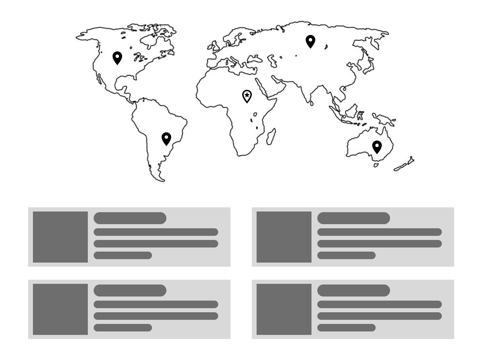

# Task for the "Web Front-end Software Engineer" position

## Story

Grundium lab personnel, using cutting-edge imaging and AI technology they possess, have recently discovered and decoded
a message from a galaxy far, far away. The message contains some meaningless JSON which at the first glance looks
like a bunch of coordinates on planet earth marking locations of mystical things (artifacts? people? who knows?).

They have passed down this JSON to Grundium engineers hoping they can make sense of it. Sadly, we don't have enough
engineers to implement the ***Locator*** application. This is where your part in the story begins :)

## Task description

Your task is to design and implement the ***Locator*** application. This is a single page application, on which the user
can see a map of the world. At the first glance, the user should be able to see the markers for those locations on the map.
The user should also be able to click and set their own location on the map. When the user location is set, a list should
appear; each item on the list corresponds to a location, and should render the data available for the being which awaits
on that location, in addition to the distance of the user to the being. The list should be sorted from closest to farthest.

## Data sources

### Coordinates

The coordinates could be fetched from an API:

To fetch a list of all the coordinates:

```http request
GET https://grundium-frontend.github.io/data/coordinates.json
```

To fetch individual coordinates:

```http request
GET https://grundium-frontend.github.io/data/id/<id>.json
```

E.g.: https://grundium-frontend.github.io/data/id/4.json

The data structure looks like:

```json
{
  "id": 4,
  "lat": -33.85664180722481,
  "long": 151.2153396118792
}
```

Where "lat" and "long" correspond to geographical latitudes and longitudes, respectively.

### Information about the beings

To fetch data about the beings who await us at those coordinates, fetch the data from:

```http request
GET https://akabab.github.io/starwars-api/api/id/<id>.json
```

E.g.: https://akabab.github.io/starwars-api/api/id/4.json

The data structure looks like:

```json
{
  "id": 4,
  "name": "Darth Vader",
  "height": 2.03,
  "mass": 120,
  "gender": "male",
  "homeworld": "tatooine",
  "wiki": "http://starwars.wikia.com/wiki/Anakin_Skywalker",
  "image": "https://vignette.wikia.nocookie.net/fr.starwars/images/3/32/Dark_Vador.jpg",
  "born": -41,
  "died": 4,
  "diedLocation": "death star ii, endor system",
  "species": "human",
  "hairColor": "blond",
  "eyeColor": "blue, yellow (dark side)",
  "skinColor": "light, later pale",
  "cybernetics": "Cybernetic right arm; later prosthetic arms and legs, and a life-support system",
  "affiliations": [
    "501st Legion",
    "Sith",
    "Galactic Empire",
    "Imperial High Command"
  ],
  "masters": [
    "Qui-Gon Jinn (informal Jedi Master)",
    "Obi-Wan Kenobi (Jedi Master)",
    "Darth Sidious (Sith Master)",
    "Yoda (Force spirit teacher)"
  ],
  "apprentices": [
    "Ahsoka Tano (Padawan)",
    "Inquisitorius"
  ],
  "formerAffiliations": [
    "Jedi Order",
    "Jedi High Council",
    "Galactic Republic"
  ]
}
```

## Requirements

1. The main front-end technology is to be selected from: Angular, React, or React frameworks, e.g., Gatsby or Next.js
2. Make it look nice, try to match the theme of the app with the content, but don't go over the top (don't spend more than a few hours)
3. Make informed decisions. Use what you think is suitable for e.g., state management, making HTTP requests, rendering the map.
4. Just to make things a little simpler, see the following UI wireframe example. But as long as the required functionality is there, feel free to change anything.

